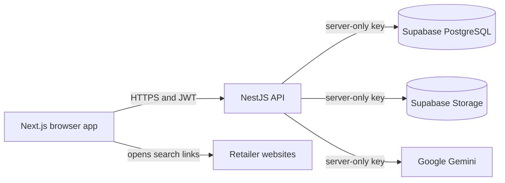

# FitFuel

FitFuel is a diet planning web app. A user can enter profile details, generate a draft meal plan with Gemini, save the plan, build a grocery list, and record what they spent after shopping. The dashboard summarizes saved plans, entered weights, and self-reported grocery spending.

**Project status:** The repository contains a deployable web and API configuration, but a deployment must be configured and tested before it can be treated as a production service. AI plans are suggestions, not medical advice. FitFuel does not place retailer orders, process payments, or verify deliveries.

Maintainer: Mohammed Faiz Nawaz.

## Architecture

| Component | Location | Responsibility |
| --- | --- | --- |
| Next.js 15 web app | [`Frontend/`](Frontend/) | App Router UI, browser session, diet planner, dashboard, shopping list |
| NestJS 11 API | [`NestJSBackend/diet-chart-generator/`](NestJSBackend/diet-chart-generator/) | JWT authentication, profile and plan APIs, Gemini calls, Supabase access |
| Supabase PostgreSQL | [`supabase/bootstrap.sql`](supabase/bootstrap.sql) | Accounts, plans, profile data, and related records |
| Supabase Storage | Created by the API on first receipt save | Private `fitfuel-receipts` bucket for self-reported receipt notes |
| Python research artifact | [`PythonBackend/`](PythonBackend/) | Separate training and FastAPI code; not used by the current web flow |



The browser calls the NestJS API through `NEXT_PUBLIC_API_URL`. The API uses its own account and JWT flow; it does not use Supabase Auth. The Supabase secret key and Gemini key belong only in the API environment. See [architecture decision records](docs/adr/README.md) for the reasons and tradeoffs.

## Requirements

- Node.js 22 and npm.
- A Supabase project with its project URL and **secret** API key.
- A Google Gemini API key with access to the configured model.
- A long, random `JWT_SECRET` for signing application tokens.

## Run locally

Run these commands from the repository root. On a new Supabase project, paste [`supabase/bootstrap.sql`](supabase/bootstrap.sql) into **Supabase Dashboard > SQL Editor** and run it once. The script creates the tables and RPCs used by the API and restricts access for browser roles. Review the SQL before applying it to an existing project.

```powershell
Copy-Item .env.example .env
Copy-Item Frontend/.env.example Frontend/.env.local
npm --prefix Frontend ci
npm --prefix NestJSBackend/diet-chart-generator ci
```

Edit the root `.env` with real values. Do not put the Supabase secret key in `Frontend/.env.local` or any variable beginning with `NEXT_PUBLIC_`.

| Variable | Where | Purpose |
| --- | --- | --- |
| `SUPABASE_URL` | API / root `.env` | Supabase project URL |
| `SUPABASE_SECRET_KEY` | API / root `.env` | Server-only database and Storage access |
| `GEMINI_API_KEY` | API / root `.env` | Diet generation and AI guide |
| `JWT_SECRET` | API / root `.env` | Signs application access and refresh tokens |
| `GEMINI_MODEL` | API, optional | Overrides the model name configured in the code |
| `NEXT_PUBLIC_API_URL` | Frontend `.env.local` | Public URL of the NestJS API; defaults to `http://localhost:3001` |

Start the services in separate terminals from the repository root:

```powershell
npm --prefix NestJSBackend/diet-chart-generator run start:dev
```

```powershell
npm --prefix Frontend run dev
```

Open `http://localhost:3000`. The API listens on port `3001` by default. Its root path returns `Hello World!`; that response confirms the process is listening, not that Supabase and Gemini are healthy. For an end-to-end check, create an account, save profile data, generate and save a plan, then record a receipt note from checkout.

## Main user flow and data

1. **Sign up and sign in:** NestJS hashes passwords and issues JWTs. The `users` and `refresh_tokens` tables store account data.
2. **Profile and medical history:** Profile fields and entered weights are saved in Supabase. Medical History displays those fields; medical document upload and extraction are not implemented.
3. **Generate and save a plan:** NestJS sends user inputs to Gemini, checks for a meal-plan response, and returns a draft. Saving writes a `Diet` record. The selected duration is saved and shown in Diet History; it does not generate a different menu for each day or measure adherence.
4. **Shop:** The grocery list persists in browser local storage until the user clears it. FitFuel opens product searches at Walmart, Wegmans, Target, Kroger, and Walgreens. The list is not sent to a retailer cart.
5. **Estimate and record spending:** The API attempts to derive rough ranges from public Kroger listings, which can be missing or inaccurate. Users may enter observed store prices and, after shopping, record an amount paid. Receipt notes are stored in a private Supabase Storage bucket and used for dashboard totals. They are not payment transactions or retailer receipts.

## Build and verification

```powershell
npm --prefix NestJSBackend/diet-chart-generator run build
npm --prefix Frontend run build
```

These commands check that each service builds. The NestJS package also has `npm test`; passing builds or unit tests does not validate a deployed Supabase project, Gemini quota, retailer listings, or the complete user journey. Verify those against the target environment before release.

## Deploy

[`render.yaml`](render.yaml) defines separate Render services for the API and web app. Follow [DEPLOYMENT.md](DEPLOYMENT.md) for the Blueprint setup, secret variables, and post-deployment checks. GitHub hosts the source code; GitHub Pages cannot run the NestJS API.

Before allowing real users, use HTTPS, set service secrets in the hosting provider, validate signup and plan generation against the production Supabase project, and review the production gaps below. Back up Supabase data and define a recovery process appropriate to the data you collect.

## Current limitations and release work

- Generated nutrition advice is not clinically validated. Users with medical conditions should review plans with a qualified clinician.
- The API currently enables CORS for all origins and has no application-wide rate limiting. Restrict origins and add abuse controls before opening the service broadly.
- The app uses custom JWT authentication and a server-only Supabase key. Review token storage, account recovery, access controls, and logging before handling sensitive health data at scale.
- Receipt notes are self-reported. The app has no payment processor, retailer order integration, or proof of delivery. Price lookup depends on public page markup and may fail.
- The Python notebook records a fine-tuning experiment, but its checkpoint is not in this repository and is not used by the running web app. The active generator is Gemini through NestJS.
- The included Render Blueprint is configuration, not proof that the service is live. Complete the end-to-end deployment checks in [DEPLOYMENT.md](DEPLOYMENT.md).

## Documentation

- [Deployment guide](DEPLOYMENT.md)
- [Architecture decision records (ADRs)](docs/adr/README.md)
- [Supabase schema](supabase/bootstrap.sql)
- [Backend environment template](.env.example)
- [Frontend environment template](Frontend/.env.example)
